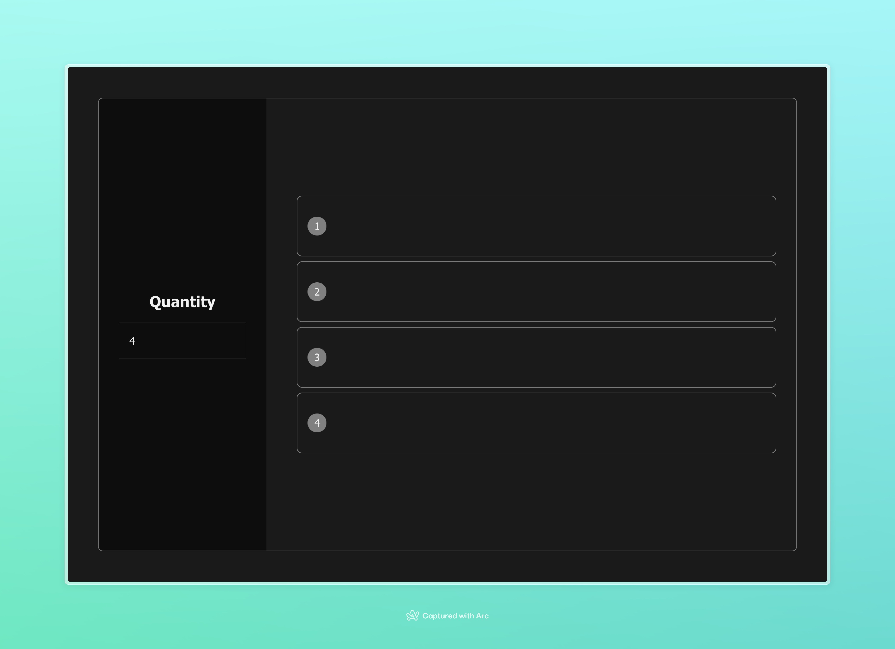

# Front-end test for GoBrunch

## Server
https://gobrunch-front-test.onrender.com

## Preview 📸


## Instructions

1) clone the project:

``` shell
git clone git@github.com:lucas-adb/gobrunch-front-test.git
```

2) Enter the folder:
``` shell
cd gobrunch-test
```

3) Install dependencies:
``` shell
npm install
```

4) Run the app
``` shell
npm run dev
```
